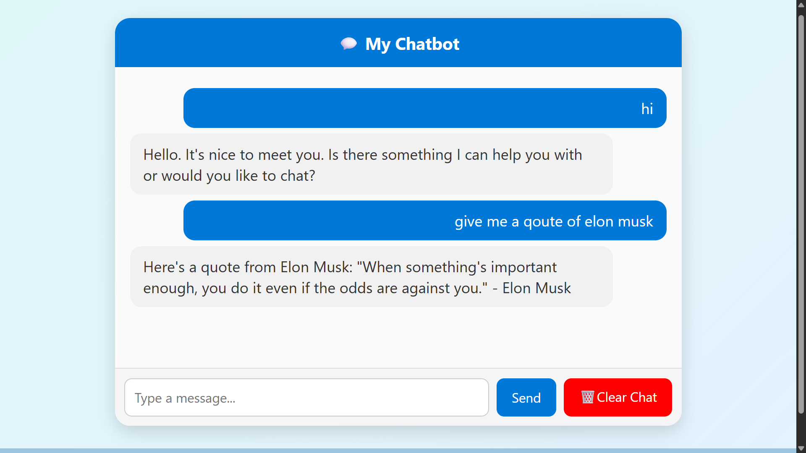

# Chatbot

A simple chatbot built with **Flask** + **Groq AI** that remembers chat history using sessions.  

---

## Features
- Flask backend with session management
- AI integration with Groq
- Chat history persistence
- Responsive frontend with HTML + CSS
- Clear chat button

---

## Screenshot


---

## Setup Instructions

1. Clone this repository:
   ```bash
    git clone https://github.com/shivashishyadav/ChatBot.git
    cd mychatbot

2. Create and activate a virtual environment:
    ```bash
    python -m venv venv
    source venv/bin/activate   # Mac/Linux
    venv\Scripts\activate      # Windows

3. Install dependencies:
    ```bash
    pip install -r requirements.txt

4. Create a .env file in the project root:
    ```bash
    FLASK_SECRET_KEY=your-secret-key
    GROQ_API_KEY=your-groq-api-key
